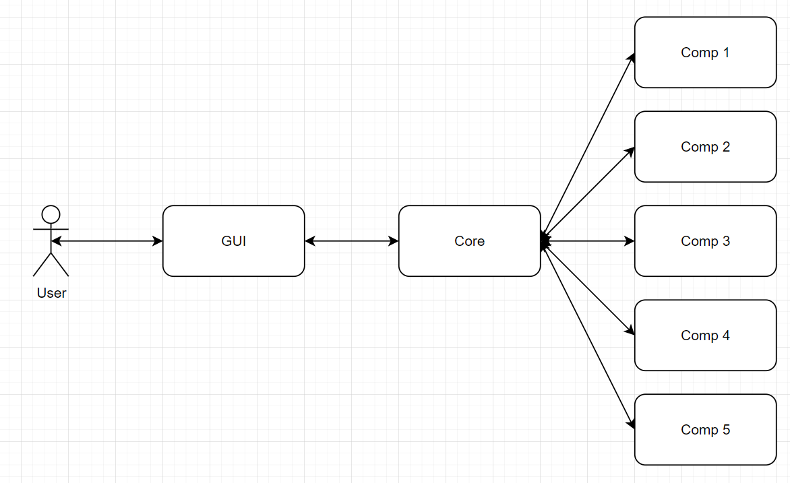

# To już jest projekt...

## Uruchamianie
Program uruchamiamy poprzez odpalenie bashowego skryptu **src/start.sh** - wszystkie komponenty i główny program są uruchamiane razem z nim.
Wymagana wersja Pythona >= 3.9.

## Architektura

Użytkownik przeprowadza interakcje z interfejsem, wprowadza dane, otrzymuje wyniki.

Dane wybierane w GUIu są zapisywane przez core, odpowiada on za przetwarzanie tych danych, wysyłanie zapytań do poszczególnych komponentów oraz za przetwarzanie odpowiedzi.

### Komunikacja

Komunikacja odbywa się poprzez gRPC. 

W folderze **src/proto** znajdują się pliki definiującę jakie wiadomości mają być przetwarzane pomiędzy modułem core a modułami komponentów.
Plik składa się z definicji serwisu, który zawiera jedną lub więcej metod służących do wymiany danych, oraz modele zapytań oraz odpowiedzi.

### GUI
Każdy komponent posiada swój widget na głównym ekranie - widgety dodawane są w metodzie **gui.main_window.MainWindow.add_filter_selectors**.
Widget zawiera: 
* pole wyboru (czy dane wybrane dla komponentu mają być wykorzystane do poszukiwań),
* nazwę,
* przycisk do wyboru parametrów,
* pole do wprowadzenie minimalnej wagi wybranych danych (opcjonalne - w niektórych komponentów nie ma sensu).

Przycisk do wyboru parametrów otwiera okno. Dla każdego komponentu zdefiniowana jest klasa okna dziedzicząca po **gui.parameter_windows.parameters_window.ParametersWindow**.
Metody, które musi definiować dziedzicząca klasa okna to:
* add_widgets - należy w niej umieścić dodawanie elementów okna: pól wyboru, tekstu, itd.
* set_values - powinna zapisywać wybrane wartość do zmiennej **self.chosen_values**
* get_size - ma zwracać wymiary okna
